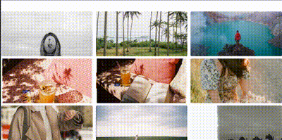
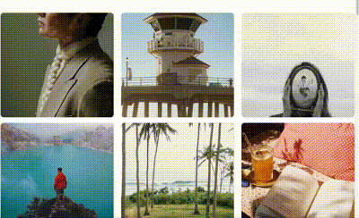

# Image Loading App aka Imagegram

This is a simple image loading application built with React and Typescript. Users can view photos, and favourite the ones they like(or unfavourite previously favourited photos).

## Getting Started

To get started with the project, follow the instructions below:

### Prerequisites

Make sure you have the following installed on your machine:

- npm (Node Package Manager)

### Installation

1. after cloning the project, run `npm install` to install dependencies.

2. Pexels API requires API Key in order to access the data. Folloe these instructions to obtain the key: [CLICK ME](https://help.pexels.com/hc/en-us/articles/900004904026-How-do-I-get-an-API-key)

3. In the root of the folder create a .env file with the following contents: REACT_APP_PEXELS_API_KEY="yourkeygoeshere".

4. run `npm start` to start the application.

5. Open: http://localhost:3000

### Project Structure

The project has the following structure:

- src/: Contains the source code.
  - api/: to fetch image data.
  - components/: React components used in the application + tests.
    - PhotoCard.tsx: Component to display photos.
    - Tooltip.tsx: Component to display photo information and favourite button.
  - hooks/: Custom hooks + tests.
    - useFavouritedState.ts: to initialise and set state from the local storage.
    - useFetchPhotos.ts: to fetch photos from api and initialise loading state.
    - useInfiniteScroll.ts: to enable infinite scrolling behaviour.
  - App.tsx: Main component, entry point to the app.

### Testing

1. to run all tests run `npm test`. Please note: some of the tests will fail in this mode, due to the testing setup config issues(as I was time limited I couldn't look deeeper into it). However all tests are passing when ran directly from the test file(e.g with Jest Runner or any other similar extension)- you can see screenshots in src/images/ folder.

_Note:_ _The standard practice is to put test files into the **tests** folder, at this point I haven't used that structure because of the simplicity of the app_

I tried to cover all of the edge case scenarios, however I do believe tests can be improved by also adding accessibility features testing.
_TODO for the future - update test config,test refactoring, increase test coverage in all files and cover more edge cases, update folder structure, accessibility testing._

### Decisions made

1. I implemented the design as closely as possible to the design in the instructions. There are potential accessibility issues due to not enough contrast between photo and tooltip text colour.
2. Upon clicking "Favourite" button the button changes colour and text("Favourited") to indicate to user that the photo was favourited.
3. App is responsive, the media queires added are for smaller screens(tablet and mobile).
